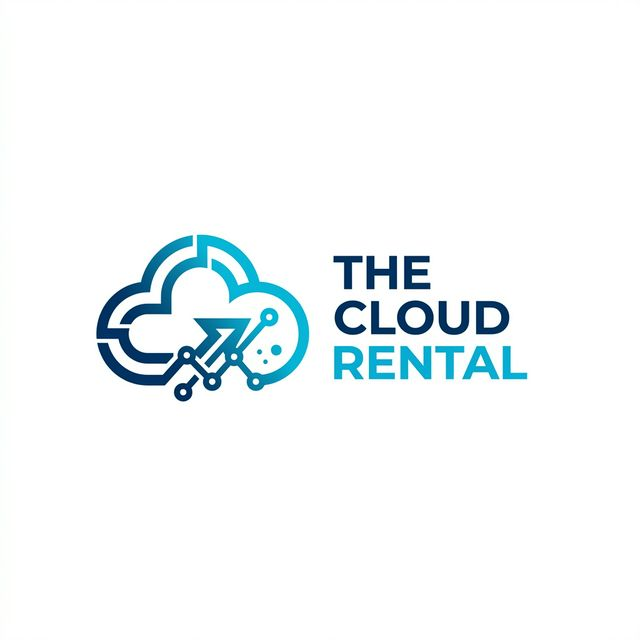

<div align="center">
  
  <h1>The Cloud Rental Web Infrastructure</h1>

  <p>
    <strong>A Premium, High-Performance IT Services & Networking Platform</strong><br>
    Built exclusively for the modern cloud infrastructure enterprise.
  </p>

  <p>
    <a href="https://Nextjs.org"></a>
    <a href="https://tailwindcss.com"></a>
    <a href="https://www.framer.com/motion/"></a>
    <a href="https://vercel.com/"></a>
  </p>
</div>

<hr>

## 🚀 Overview

**The Cloud Rental** frontend architecture is engineered for absolute top-tier user experience. It leverages the raw power of **Next.js 15 (App Router)** and **Serverless Edge APIs**, combined with an ultra-premium visual aesthetic driven by Tailwind CSS v4 and Framer Motion spring physics.

The platform also acts as a globally distributed **Headless WordPress** consumer, allowing developers to maintain a blistering fast Next.js frontend while content creators seamlessly write blogs using the native WordPress dashboard via `WPGraphQL`.

---

## ✨ Key Features

- **Liquid Premium UI:** Breathtaking glassmorphism, ambient gradients, floating physics, and deep magnetic glows.
- **Global Light/Dark Theme Morph:** Completely uncoupled Tailwind CSS token inversion allowing a flawless, instant, zero-reload transition from Dark Navy to Frosted Cloud Blue.
- **Serverless Unified API:** Contact routing and Booking operations handled natively via Next.js Edge APIs (`/api/contact` & `/api/book`), stripping away the need for separate Express backend hosting.
- **Automated Deployments:** Fully integrated Vercel Git webhooks. Every single push automatically updates the global production server within 60 seconds (`thecloudrental.com`).
- **Headless Pipeline:** Natively fetches blog schemas from an external WordPress administration droplet using highly cached edge queries.

---

## 🛠 Tech Stack

*   **Core:** React 19 + Next.js 15 (App Router)
*   **Aesthetics:** Tailwind CSS v4 Core
*   **Interactions:** Framer Motion (Spring physics & scroll timelines)
*   **Typography:** Google Inter font matrix
*   **Infrastructure:** Native Next.js Serverless Routes
*   **Language:** TypeScript (Strict)

---

## 🏃‍♂️ Getting Started Locally

### 1. Requirements
Ensure you have **Node.js 18+** installed before proceeding.

### 2. Installation
Clone the repository and install all dependencies:
```bash
git clone https://github.com/princegarg001/The-Cloud-Rental.git
cd The-Cloud-Rental
npm install
```

### 3. Environment Context
Create a `.env.local` file at the root of the project to map the WordPress API securely:
```env
# URL for the external WordPress Headless API
NEXT_PUBLIC_WORDPRESS_API_URL=https://wp.thecloudrental.com/wp-json/wp/v2
```

### 4. Boot up
Fire up the Next.js Turbo compiler:
```bash
npm run dev
```
Open [http://localhost:3000](http://localhost:3000) inside your browser.

---

## 🌎 Deployment Pipeline

This repository is surgically bound to **Vercel** via GitHub integrations. 

To deploy any changes to the global production URL (`thecloudrental.com`), you only need to run a single command from your local terminal. We have hardcoded a deployment macro into the application core:

```bash
npm run deploy
```

*(This command sequences `git add`, `git commit`, and `git push`, triggering an instant Vercel build phase and updating edge servers worldwide).*

---

## 🔐 Licensing Structure
Proprietary software strictly developed for `The Cloud Rental`. Codebase distribution strictly prohibited.
